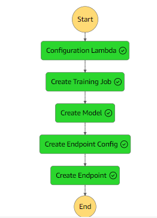
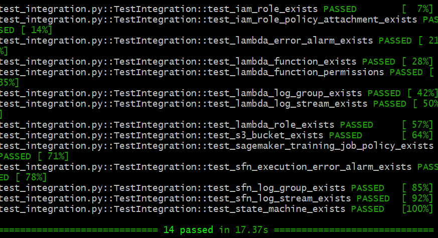

# Movie Recommendation System

## Overview
The Movie Recommendation System project aims to develop a robust recommendation system to suggest movies to users based on their preferences. By analyzing user ratings and movie metadata, the system generates personalized recommendations, enhancing the user experience on movie streaming platforms.

### Dataset
The dataset used for this project contains user ratings for various movies. Each record includes information such as userId, movieId, rating, and timestamp. The dataset is sourced from Kaggle, and you can find it here.

## Methodology
#### Data Preparation
The data is preprocessed to create the target variable 'liked', indicating whether the user liked a movie (rating >= 4).
Categorical variables like userId and movieId are one-hot encoded using sklearn's OneHotEncoder.

## Model Building
The recommendation system utilizes machine learning algorithms to predict user preferences.
Techniques such as collaborative filtering and matrix factorization were be employed to generate accurate recommendations.

## Objective
The primary objective of this project is to develop an efficient and accurate movie recommendation system that enhances user satisfaction and engagement on movie platforms.

## Key Outcomes
Development of a user-friendly recommendation system.
Improved user experience and engagement on movie streaming platforms.
Promotion of content discovery and increased user retention.

## Beneficiaries
The project benefits movie enthusiasts, streaming platforms, and content creators by providing personalized movie recommendations tailored to individual preferences.


## Installation

```bash
# Clone the repository
git clone https://github.com/Taciturny/Recomm_Movies.git
# Change to the project directory
cd Recomm_Movies
```
# Project Structure
```bash
Recomm_Movies/
│
├── data/
│   ├── ratings_small.csv        
│   
│  
│
├── terraform/
│   ├── modules/
│   │   ├── main.tf               # Terraform configuration for SageMaker, Lambda, Cloudwatch (Monitoring), Stepfunctions
│   │   └── variables.tf          # Variables for SageMaker, Lambda, Cloudwatch (Monitoring), Stepfunctions
│   ├── main.tf                   # Main Terraform configuration
│   ├── provider.tf               # Provider configuration
│   └── variables.tf   
│
├── src/
│   ├── deploy.sh                 # Script to deploy the terraform
│   ├── train.py                  # Training/Preprocessing script
│   └── evaluate.py               # Evaluating script
│
├── tests/
│   ├── infrastructure/
│   │   ├── test_integration.py     # Integration tests for Terraform configurations
│   └── Lambda /
│       ├── unit_test.py        # Unit tests for Lambda function
│
├── cicd/
│   ├── pipeline/
│   │   ├── pipeline.yaml         # AWS CodePipeline configuration
│   │   └── ...
│   └── scripts/
│       ├── build.sh              # Script for building CI/CD artifacts
│       └── deploy.sh             # Script for deploying CI/CD pipeline
│
├── docs/
│   ├── architecture_diagram.png  # Architecture diagram
│   └── ...
│
├── README.md                     # Project documentation
└── requirements.txt              # Python dependencies
```

## Reproducibility Steps

### Step 1: Configure AWS Environment

1. After cloning, create an account in AWS [Sign-Up](https://portal.aws.amazon.com/billing/signup#/start/email)
2. Locate the IAM services under Roles and create the User & Access keys
3. Assign the AdministratorFullAccess permission for this project (Note: This permission is typically not advisable, but it's used for this project)
4. Download AWS CLI locally [AWS CLI Installation Guide](https://docs.aws.amazon.com/cli/latest/userguide/getting-started-install.html)
5. Configure AWS CLI and provide the keys from step 2
6. Create an S3 bucket for terraform and save the data for model training:

   ```bash
   aws s3 mb s3://[bucket_name]
   ```

### Step 2: Run Train script
1. Navigate to the `src` folder. Before running the `train.py` script, users can customize the following inputs:

2. **S3 Bucket Name and Key**: 
   - Users can specify the name of the S3 bucket where the dataset is stored (`s3_bucket`) and the key (path) to the CSV file (`s3_key`).

3. **Hyperparameters**:
   - `num_factors`: Number of factors to use in the factorization model.
   - `epochs`: Number of training epochs.
   - `mini_batch_size`: Mini batch size for training.

4. **SageMaker Instance Type (Optional)**:
   - Users can optionally specify the SageMaker instance type (`instance_type`) for training the model. Default value is `ml.c4.xlarge`.

5. Factoriaztion-Machine image
   * Users should print the image uri which will be used in the step function in step 3

6. Run the command
    ```bash
    python train.py
    ```

### Step 3: Configure Terraform

1. **Download and Configure Terraform**: [Download Terraform](https://www.terraform.io/downloads) and set it up locally on your machine.

2. **Navigate to Terraform Directory**: Using your command line interface, navigate to the directory containing your Terraform configuration files.

3. **Modify Terraform Code**: Open the Terraform configuration files (typically with a `.tf` extension) in a text editor. Here are the key aspects that can be customized:

    * **Bucket Name**: In the Terraform code, locate the declaration for the S3 bucket and update the `bucket` attribute with your desired bucket name.

    * **IAM Role Names**: If you want to change the names of IAM roles, find the relevant resource blocks for IAM roles and update the `name` attribute.

    * **IAM Policy Permissions**: Adjust the permissions in the IAM policy documents according to your requirements. You can add or remove actions and resources as needed.

    * **Lambda Function Configuration**: Modify parameters such as function name, handler, runtime, memory size, and timeout in the Lambda function resource block. This can be found in the variables.tf.

    * **CloudWatch Event Rule**: Customize the event pattern in the CloudWatch event rule to match the events that should trigger the Lambda function.

    * **CloudWatch Log Groups and Streams**: Update the names and retention periods of CloudWatch log groups and streams as desired.

    * **CloudWatch Alarms**: Configure CloudWatch alarms with appropriate thresholds and settings for monitoring Lambda errors and Step Function execution errors.

    * **Step Function Definition**: Adjust the Step Function definition to define the workflow of your state machine. Update task resources, parameters, and transitions as needed.

4. **Deploy Terraform Infrastructure**: After making the necessary modifications, save your changes and run the following command to deploy the Terraform infrastructure:
    ```bash
    ../src/deploy.sh
    ```
### Step 4: Execute the State Machine
After deploying the terraform infrastructure, execute the step function using the following command:

```bash
aws stepfunctions start-execution --state-machine-arn <state-machine-arn>
```




### Step 5: Integration and Unit Tests
1. Navigate to the `Tests` folder
2. To run the unit test, navigate to the `Lmabda` folder execute the following command:
    ```bash
    python unit_test.py
    ```
3. Additionally, navigate to the `infrastructure` folder for the integration test and execute the following command:
    ```bash
    pytest -v test_integration.py
    ```

