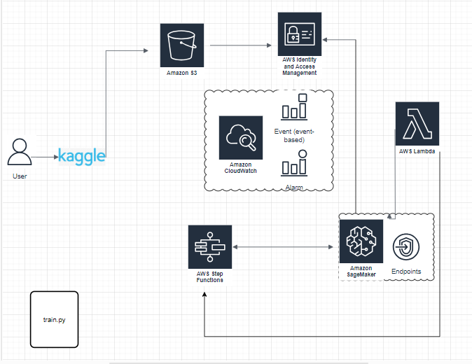
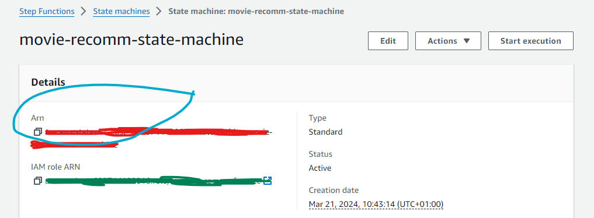
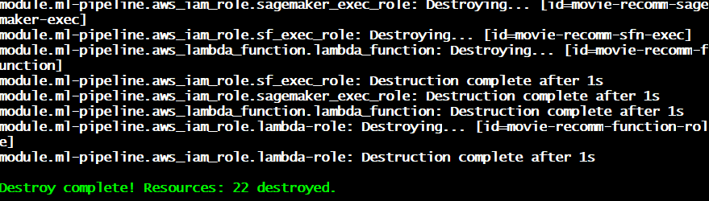

# Movie Recommendation System

## Overview
The Movie Recommendation System project aims to develop a robust recommendation system to suggest movies to users based on their preferences. By analyzing user ratings and movie metadata, the system generates personalized recommendations, enhancing the user experience on movie streaming platforms.

### Dataset
The dataset used for this project contains user ratings for various movies. Each record includes information such as userId, movieId, rating, and timestamp. The dataset is sourced from Kaggle, and you can find it [here](https://www.kaggle.com/code/rounakbanik/movie-recommender-systems/data).

## Methodology
#### Data Preparation
The data is preprocessed to create the target variable 'liked', indicating whether the user liked a movie (rating >= 4). Categorical variables like userId and movieId are one-hot encoded using sklearn's OneHotEncoder.

## Model Building
The recommendation system utilizes machine learning algorithms to predict user preferences. Techniques such as collaborative filtering and matrix factorization are employed to generate accurate recommendations.

## Objective
The primary objective of this project is to develop an efficient and accurate movie recommendation system that enhances user satisfaction and engagement on movie platforms.

## Key Outcomes
- Development of a user-friendly recommendation system.
- Improved user experience and engagement on movie streaming platforms.
- Promotion of content discovery and increased user retention.

## Beneficiaries
The project benefits movie enthusiasts, streaming platforms, and content creators by providing personalized movie recommendations tailored to individual preferences.

## Installation
```bash
# Clone the repository
git clone https://github.com/Taciturny/Recomm_Movies.git

# Change to the project directory
cd Recomm_Movies
```


# Project Structure
```bash
Recomm_Movies/
│
├── data/
│   └── ratings_small.csv            # Sample movie ratings data
│    
├── terraform/
│   ├── modules/
│   │   ├── main.tf                   # Terraform configuration for SageMaker, Lambda, Cloudwatch (Monitoring), Stepfunctions
│   │   └── variables.tf              # Variables for SageMaker, Lambda, Cloudwatch (Monitoring), Stepfunctions
│   ├── main.tf                       # Main Terraform configuration
│   ├── provider.tf                   # Provider configuration
│   └── variables.tf                  # Terraform variables
│
├── src/
│   ├── deploy.sh                    # Script to deploy the terraform
│   ├── train.py                     # Script for training models and preprocessing data
│   ├── evaluate.py                  # Script for evaluating models
│   ├── __init__.py                  # Initialization file for the src package
│   ├── cb.py                        # Content-Based recommendation script
│   ├── preprocess.py                # Script for data preprocessing for Content-Based recommendation
│   ├── config/                      # Configuration files
│   │   └── cf_config.py             # Configuration file for Collaborative Filtering
│   └── cf.py                        # Collaborative Filtering recommendation script
│
├── tests/
│   ├── infrastructure/
│   │   └── test_integration.py      # Integration tests for Terraform configurations
│   └── Lambda/
│       └── unit_test.py             # Unit tests for Lambda function
│
├── cicd/
│   ├── pipeline/
│   │   └── pipeline.yaml            # AWS CodePipeline configuration
│   └── scripts/
│       ├── build.sh                  # Script for building CI/CD artifacts
│       └── deploy.sh                 # Script for deploying CI/CD pipeline
│
├── docs/
│   └── architecture_diagram.png      # Architecture diagram
│
├── README.md                         # Project documentation
└── requirements.txt                  # Python dependencies
```

## Reproducibility Steps

### Step 0: Set Up Python Environment

1. **Create Virtual Environment** (Optional but Recommended):
   - It's recommended to work within a virtual environment to isolate your project's dependencies. If you're using `venv`, run the following command:
     ```bash
     python -m venv myenv --python=3.8
     ```
   - If you're using `conda`, create a new environment:
     ```bash
     conda create --name myenv python=3.8
     ```

2. **Activate the Environment**:
   - For `venv`:
     ```bash
     source myenv/bin/activate
     ```
   - For `conda`:
     ```bash
     conda activate myenv
     ```

### Step 1: Install Dependencies

1. **Install pip (if not already installed)**:
   - If you haven't installed `pip` yet, you can do so by following [these instructions](https://pip.pypa.io/en/stable/installation/).

2. **Install Requirements**:
   - Navigate to the root directory of your project where `requirements.txt` is located.
   - Run the following command to install the required packages:
     ```bash
     pip install -r requirements.txt
     ```

### Step 2: Configure AWS Environment

1. **Create AWS Account and IAM User**:
   - After installing AWS CLI, create an account in AWS and navigate to the [IAM service](https://console.aws.amazon.com/iam/) under Roles. Create a user and access keys.

2. **Assign AdministratorFullAccess Permission**:
   - Assign the `AdministratorFullAccess` permission to the IAM user for this project. Note: This permission is typically not advisable but is used for this project.

3. **Download and Install AWS CLI**:
   - Download AWS CLI locally by following the [AWS CLI Installation Guide](https://docs.aws.amazon.com/cli/latest/userguide/getting-started-install.html).

4. **Configure AWS CLI**:
   - Configure AWS CLI and provide the access keys obtained in step 2.

5. **Create S3 Bucket**:
   - Create an S3 bucket for Terraform and save the data for model training:
     ```bash
     aws s3 mb s3://[bucket_name]
     ```

### Step 3: Run Train Script

1. **Navigate to `src` folder**:
   - Before running the `train.py` script, users can customize the following inputs:

2. **S3 Bucket Name and Key**:
   - Users can specify the name of the S3 bucket where the dataset is stored (`s3_bucket`) and the key (path) to the CSV file (`s3_key`) to save the protobuf data suitable for matrix factorization modeling.

3. **Hyperparameters**:
   - `num_factors`: Number of factors to use in the factorization model.
   - `epochs`: Number of training epochs.
   - `mini_batch_size`: Mini batch size for training.

4. **SageMaker Instance Type (Optional)**:
   - Users can optionally specify the SageMaker instance type (`instance_type`) for training the model. Default value is `ml.c4.xlarge`.

5. **Factorization-Machine Image**:
   - Users should print the image URI which will be used in the step function in step 3.

6. **Run the Command**:
    ```bash
    python train.py
    ```


### Step 4: Configure Terraform

1. **Download and Configure Terraform**: 
   - [Download Terraform](https://www.terraform.io/downloads) and set it up locally on your machine.

2. **Navigate to Terraform Directory**: 
   - Using your command line interface, navigate to the directory containing your Terraform configuration files `terraform`.

3. **Modify Terraform Code**: 
   - Open the Terraform configuration files (typically with a `.tf` extension) in a text editor. Customize the following aspects:
   
      - **Bucket Name**: Update the `bucket` attribute in the Terraform code with your desired bucket name.
      - **IAM Role Names**: Update the `name` attribute in relevant resource blocks for IAM roles.
      - **IAM Policy Permissions**: Adjust permissions in IAM policy documents as needed.
      - **Lambda Function Configuration**: Modify parameters such as function name, handler, runtime, etc., in `variables.tf`.
      - **CloudWatch Event Rule**: Customize event pattern in CloudWatch event rule.
      - **CloudWatch Log Groups and Streams**: Update names and retention periods.
      - **CloudWatch Alarms**: Configure alarms for monitoring Lambda errors and Step Function execution errors.
      - **Step Function Definition**: Adjust Step Function definition to define the workflow of your state machine.

4. **Deploy Terraform Infrastructure**: 
   - After making necessary modifications, save your changes and deploy the Terraform infrastructure:
     ```bash
     ../src/deploy.sh
     ```

### Step 5: Execute the State Machine

Refer to the screenshot below to locate the `Arn`, which should be placed in the designated area: `<state-machine-arn>`


**Execution**: 
   - After deploying the Terraform infrastructure, follow these steps to execute the Step Function:
     - In the root directory, execute the Step Function using the following command, replacing `<state-machine-arn>` with the ARN of your state machine:
       ```bash
       aws stepfunctions start-execution --state-machine-arn <state-machine-arn>
       ```
     - Monitor the execution of the state machine using the AWS Step Functions console or CLI.

**Step Function Success Notification Screenshot**:


### Step 6: Tests (Unit and Integration Tests)

1. **Navigate to the `Tests` Folder**:
   - Open your command line interface and navigate to the `Tests` folder in your project directory.

2. **Run Unit Test**:
   - Navigate to the `Lambda` folder and execute the following command to run the unit test:
     ```bash
     python unit_test.py
     ```

3. **Run Integration Test**:
   - Additionally, navigate to the `infrastructure` folder for the integration test and execute the following command:
     ```bash
     pytest -v test_integration.py
     ```

The screenshot below indicates that all 14 tests were successful:


### Step 7: Clean Up

Execute the following command to clean up resources:

```bash
terraform destroy --auto-approve   
```

The screenshot below shows that all 22 resources created with Terraform have been successfully destroyed:

